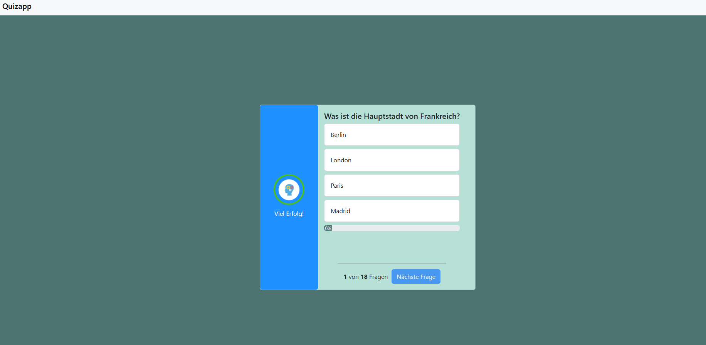

# 🧠 Quiz App

Eine einfache, interaktive Quiz-Anwendung, entwickelt mit HTML, CSS und JavaScript.
Das Projekt dient als Lern- und Übungsprojekt für grundlegende Webentwicklung und Logik im Frontend.



🔗 **Live Demo:**
https://ismael993-create.github.io/QuizzApp/

---

## 🚀 Features

* Multiple-Choice-Fragen mit 4 Antwortmöglichkeiten
* Auswertung der richtigen Antworten
* Dynamisches Anzeigen der nächsten Frage
* Einfache und übersichtliche Benutzeroberfläche
* Erweiterbar mit eigenen Fragen

---

## 🛠️ Technologien

* **HTML** – Struktur der Anwendung
* **CSS** – Styling und Layout
* **JavaScript** – Logik, Interaktivität und Quiz-Mechanik
* **Bootstrap Design

---


## ✏️ Eigene Fragen hinzufügen

Die Fragen werden in einem JavaScript-Array gespeichert (`script.js`).

Beispiel:

```js
{
  question: "Frage hier",
  answers1: "Antwort A",
  answers2: "Antwort B",
  answers3: "Antwort C",
  answers4: "Antwort D",
  rightAnswer: 2,
}
```

👉 Du kannst einfach neue Objekte hinzufügen, um dein Quiz zu erweitern.

---

## 🎯 Ziel des Projekts

Dieses Projekt wurde erstellt, um:

* JavaScript-Grundlagen zu üben
* Logik und Zustandsverwaltung zu verstehen
* DOM-Manipulation zu lernen
* Ein eigenes kleines Webprojekt umzusetzen

---


## 📄 Lizenz

Dieses Projekt ist frei nutzbar für Lernzwecke.

---

## 👨‍💻 Autor

Erstellt von **Ismael**

---

